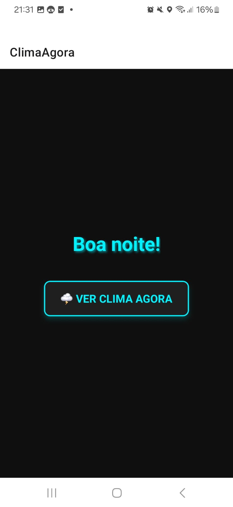
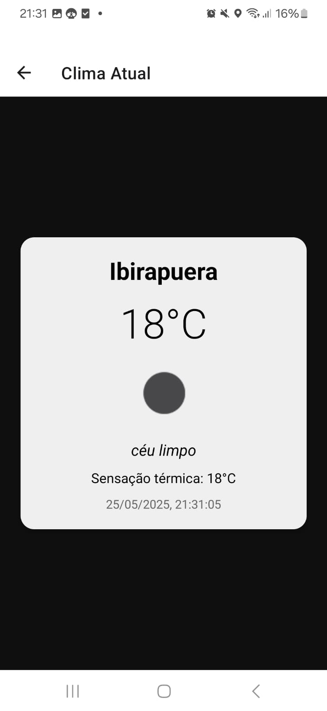

# 🌤️ ClimaAgora

Aplicativo mobile em React Native que mostra as condições climáticas atuais com base na localização do usuário.

## 📱 Funcionalidades

- Obtenção da localização atual com permissão
- Exibição de:
  - Nome da cidade
  - Temperatura atual
  - Condição do clima (ex: céu limpo)
  - Sensação térmica
  - Ícone do clima
  - Data e hora atual formatada
- Saudação dinâmica ("Bom dia", "Boa tarde", etc.)
- Navegação entre telas com React Navigation

## 🧪 Tecnologias utilizadas

- [React Native](https://reactnative.dev/)
- [Expo](https://expo.dev/)
- [React Navigation](https://reactnavigation.org/)
- [OpenWeatherMap API](https://openweathermap.org/api)
- [Expo Location](https://docs.expo.dev/versions/latest/sdk/location/)

## 🔑 API Usada

OpenWeatherMap  
[https://openweathermap.org/api](https://openweathermap.org/api)

## 📸 Prints da Aplicação

### 🏠 Tela Inicial

### ☀️ Tela de Clima

## 🚀 Como rodar o projeto

1. Clone este repositório
2. Instale as dependências com `npm install`
3. Rode com `npx expo start` e escaneie o QR code com o app Expo Go

---

Desenvolvido para a disciplina de Desenvolvimento Mobile 📲

Desenvolvido por João Paulo Francisco de Oliveira RM557410 e Marcelo Antonio Scoleso Junior RM557481
